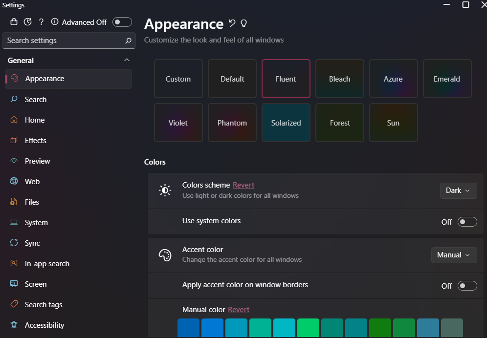

<p align="center"><a href="https://getsharex.com"></a></p>
<h1 align="center">SnapX</h1>
<h3 align="center">Screen capture, file sharing and productivity tool. All for you.</h3>
<br>
<div align="center">
  <a href="https://github.com/BrycensRanch/SnapX/actions/workflows/build.yml"></a>
  <a href="./LICENSE.txt"></a>
  <a href="https://github.com/BrycensRanch/SnapX/releases/latest"></a>
  <a href="https://getsharex.com/downloads"></a>
  <a href="https://discord.gg/ys3ZCzttVQ"></a>
</div>
<br>
<p align="center"><a href="https://github.com/BrycensRanch/SnapX"></a></p>

# :construction: This project is under development and is not ready for use. :construction:
## :warning: Disclaimer

SnapX is a [hard fork](https://producingoss.com/en/forks.html) of the application [ShareX](https://github.com/ShareX/ShareX).
- It uses [.NET 9](https://learn.microsoft.com/en-us/dotnet/core/whats-new/dotnet-9/overview), [ImageSharp](https://docs.sixlabors.com/articles/imagesharp/?tabs=tabid-1) (cross-platform image manipulation library)
- And it *will* use [SQLite](https://www.sqlite.org/about.html) to store history.
- Additionally, all uploaders are now forced to use HTTPS.
- Keeps compatability with uploader configuration
- As a user, you do **NOT** need to have .NET installed. Whether you be on Windows, Linux, or macOS.

What does this all mean? It means you'll be able to have a more **performant**, **reliable**, and _modern_ application.

You will _not_ receive any support from the ShareX project for this software.
If you have any issues with this project, please **open an issue** in this repository.

However, it's important to note that this project is maintained by volunteers,
and we may not be able to provide support for all issues.
We will do our best to help you, but we cannot guarantee that we will be able to resolve your issue.

<p align="center">For further information, please check the source code.</p>

## Supported Linux Distributions

This project is built on Ubuntu 24.04 and is tested on the following distributions:

- Ubuntu 24.04
- Fedora 41

If you're using a different distribution, there will be a Flatpak package available when possible. If you're using a distribution that doesn't support Flatpak, you can build the project from source.

## Other platforms

When I initially started this port, I only came with one main goal: ShareX on Modern Linux on native Wayland.
I realized my work could be used on other platforms such as macOS or Windows...

That's why SnapX.Avalonia was created.

It's powered by [FluentAvalonia](https://github.com/amwx/FluentAvalonia), it *can* look something like this. Screenshot from [FluentSearch](https://github.com/adirh3/Fluent-Search): 

And yet, it runs on Windows, Linux, and macOS.
Additionally, it looks the same on every OS. (besides fonts)

Regarding screenshotting, there are a lot of solutions to the problem. I want this port to be easier to maintain than upstream. Personally, I'm open to PRing any missing spots in any cross platform screenshot/capture library instead of maintaining it in the repository.

## Development Dependencies

Instructions for other projects within the SnapX solution are not provided yet.

- `git`
- `gtk4-devel` on Fedora or `libgtk-4-dev` on Ubuntu
- `dotnet-sdk-9.0`
- `ffmpeg` (7.0.0)
- `clang`
- `zlib-devel`

### Ubuntu 24.04

```bash
sudo apt update -q && sudo apt install -y software-properties-common
sudo add-apt-repository ppa:dotnet/backports # Ubuntu 24.04 doesn't have .NET 9 packaged
sudo add-apt-repository ppa:ubuntuhandbook1/ffmpeg7 # Ubuntu 24.04 doesn't have FFMPEG 7 packaged.
sudo apt install -y git libgtk-4-dev dotnet-sdk-9.0 ffmpeg clang zlib1g-dev
```

### Fedora 41

```bash
sudo dnf install -y git gtk4-devel dotnet-sdk-9.0 /usr/bin/ffmpeg clang zlib-devel
```

## Building from Source

Only do this if you're a developer, the solution _does_ build, but, you should have a backup of all your ShareX/SnapX data.
The migration from Newtonsoft.Json to System.Text.Json is not done yet.
I've personally experienced cases of configuration corruption (ie the configuration turning into an empty object)
Any help with the migration is greatly appreciated.

```bash
git clone https://github.com/BrycensRanch/SnapX
cd SnapX
dotnet build
```

Lastly...

I use Fedora Rawhide btw :^)

[Fine, I'll do it myself.](https://www.youtube.com/watch?v=L_WoOkDAqbM)
