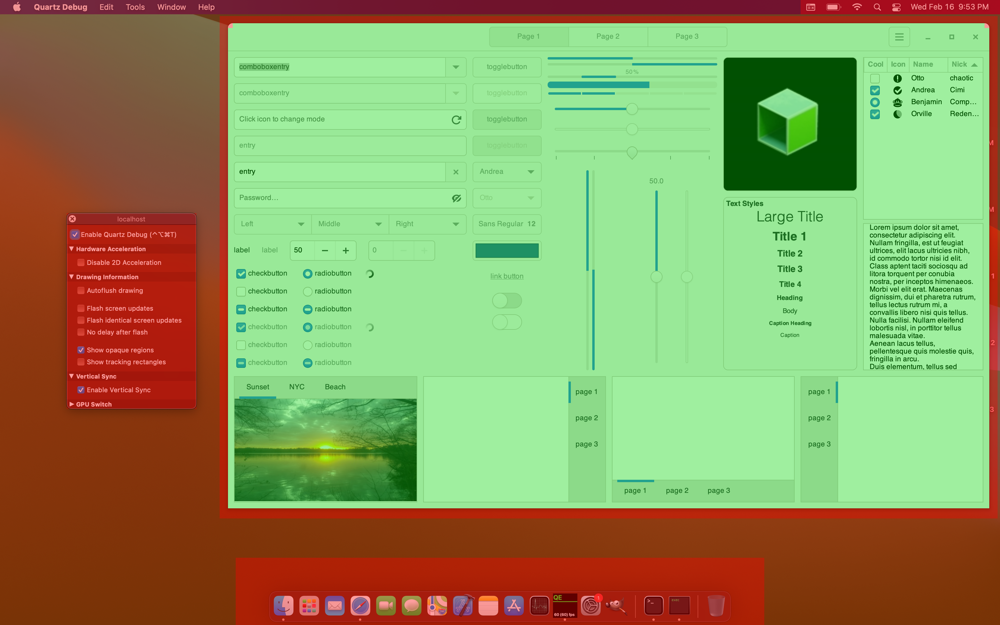
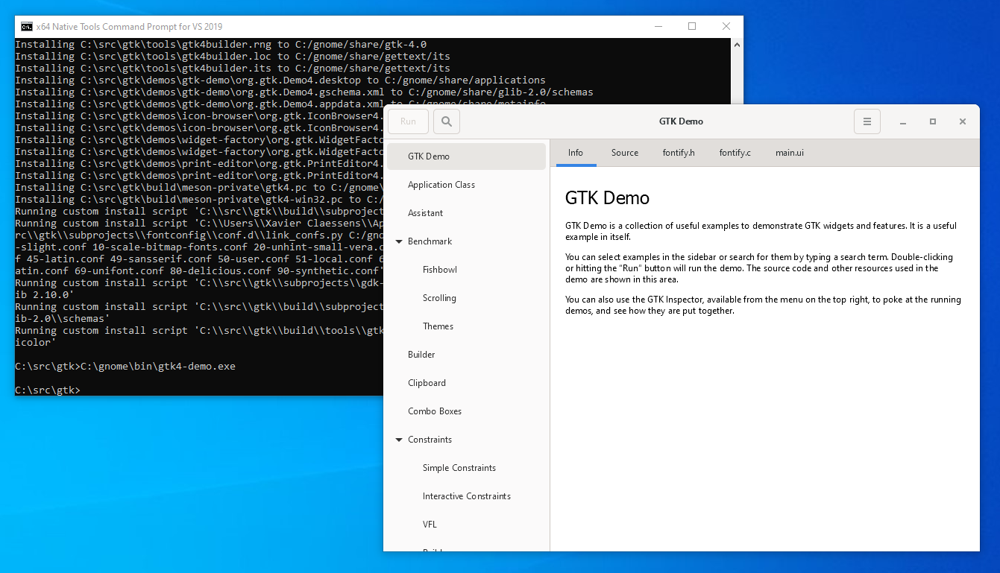

<p align="center"><a href="https://getsharex.com"></a></p>
<h3 align="center">Screen capture, file sharing and productivity tool. Now on Linux</h3>
<br>
<div align="center">
  <a href="https://github.com/BrycensRanch/ShareX-Linux-Port/actions/workflows/build.yml"></a>
  <a href="./LICENSE.txt"></a>
  <a href="https://github.com/BrycensRanch/ShareX-Linux-Port/releases/latest"></a>
  <a href="https://getsharex.com/downloads"></a>
  <a href="https://discord.gg/ys3ZCzttVQ"></a>
</div>
<br>
<p align="center"><a href="https://github.com/BrycensRanch/ShareX-Linux-Port"></a></p>
<p align="center">For further information please check the source code.</p>

# :construction: This project is under development and is not ready for use. :construction:

Focusing on Wayland, with GTK4 to replace the dependency on Windows Forms.

## :warning: Disclaimer

This is a port of the original ShareX application to Linux. It is not an official release and is not affiliated with the original ShareX project. The original ShareX project is licensed under the GNU General Public License v3.0, and this project is licensed under the same license. This project is not endorsed by the original ShareX project.

You can find the original ShareX project [here](https://github.com/ShareX/ShareX).

You will not receive any support from the original ShareX project for this port. If you have any issues with this port, please open an issue on this repository. However, it's important to note that this project is maintained by volunteers, and we may not be able to provide support for all issues. We will do our best to help you, but we cannot guarantee that we will be able to resolve your issue.

## Supported Linux Distributions

This project is built on Ubuntu 24.04 and is tested on the following distributions:

- Ubuntu 24.04
- Fedora 40

If you're using a different distribution, there will be a Flatpak package available when possible. If you're using a distribution that doesn't support Flatpak, you can build the project from source.

## Other platforms

Hi, macOS users.
One of the project's goals is to make ShareX more portable.
GTK4 *does* work on macOS and Windows but the building instructions are a bit different than usual.
Hopefully down the line, I can hope to document this for you.





## Development Dependencies

- `git`
- `gtk4`
- `gtk4-devel` (Fedora)
- `libgtk-4-dev`
- `dotnet-sdk-9.0`
- `ffmpeg` (6.0.0)
- `imagemagick`
- `p7zip-devel`
- `libgdiplus`
- `build-essential` (Ubuntu)
- `@development-tools` (Fedora)
- `libgdiplus-devel` (Fedora)

Also sudo dnf group install "C Development Tools and Libraries" (Fedora) (Just to be safe)

At this point, I'm guessing. I already have all of these installed on my system. :3

Fedora users will able to cross compile for Windows. This is not supported under Ubuntu

### Ubuntu 24.04

```bash
sudo apt install git gtk4 libgtk-4-dev dotnet-sdk-9.0
```

### Fedora 40

```bash
sudo dnf install git gtk4 gtk4-devel dotnet-sdk-9.0
```

## Building from Source

I don't think it will build... at all for some time.

```bash
git clone https://github.com/BrycensRanch/ShareX-Linux-Port
cd ShareX-Linux-Port
dotnet build
```

Lastly...

I use Fedora Rawhide btw :^)

[Fine, I'll do it myself.](https://www.youtube.com/watch?v=L_WoOkDAqbM)
